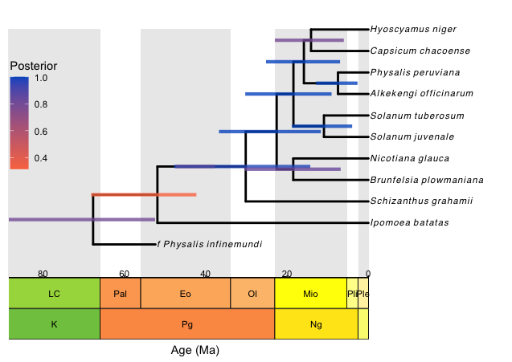

```{r setup, include=FALSE}
knitr::opts_chunk$set(echo = TRUE)
```

***

## Introduction

A **bayesian total evidence dating** (TED) analysis simultaneously infer **the topology** and **the divergence time** of a set of terminals. This approach has several advantages. First, it doesn't require us to place the fossils in a specific clade -as it is required for node dating-, instead, the fossil specimens are placed in the phylogeny based on their own **morphological** and **temporal** information. As a result, we obtain posterior probabilities on the fossil placements, as opposed of having to assume their phylogenetic position. Second, with this approach, we can include **more than one fossil** putatively belonging to a group, whereas in node dating we usually pick only the oldest fossil to calibrate a node of interest. By including all the fossils available for a group we may have a more complete picture of it.

But as interesting and promising as Bayesian TED analyses are, they are complex. As we analyze more empirical data under this model, we are starting to better understand the interaction of the different parts of the model. And it has become clear that it is important that we understand the implications of our modeling decisions.This tutorial was written by an empiricist with interest in TED methods. The objective of it is to serve as an **introduction to the Bayesian Total Evidence Dating Model**, using the software RevBayes. I will focus on discussing the **different components** of the model, highlighting the way we **express our prior believes** about our study system, and how these components and priors translate into RevBayes language scripts. An equally important objective for me is to facilitate an introduction to the _linguo_ of Bayesian TED analyses and the structure of RevBayes. Throughout the tutorial, I will point out to several references and other tutorials where you will be able to dig into some of the topics we will only superficially cover.
The code of this tutorial can be easily adapted to run a total-evidence analysis on your own data. For a more advanced tutorial on Bayesian TED analyses -including code for comparing different models and assessing the adequacy of the model- visit [this page](https://revbayes.github.io/tutorials/ted_workflow/). Finally, once you have completed this introductory workshop, I invite you to check the more extensive lecture recordings of our Time Divergence Estimation [one month long workshop](https://mikeryanmay.github.io/ted.workshop.github.io/).

#### A glimpse to the Bayesian Total Evidence Dating model

**The type of data**.

Before diving into the details of the model it is worth to mention the type of data you need to consider using the Bayesian TED model. When the study group includes extant and extinct terminals, the dataset typically includes **both molecular and a morphological traits**. But a TED analysis can also be performed using only morphological traits, this is particularly plausible in a case where all the terminals are fossils. There is nothing restrictive about the number of fossils used, but some recommendations are to have fossils widespread in time and among lineages. 


**The Bayesian TED model**

A Bayesian Total Evidence Dating model can be understood as having several components, that are themselves models of specific processes (Fig.1). These components describe specific processes. All these components fit together in a general TED where they have the potential to inform each other through their interactions. As we can see in figure one, we have **models of character evolution** that describe the way in which characters (morphological or molecular) change across lineages. We have **clock models** that describe the rate at which changes (morphological or molecular) occur along lineages. And we also have a **timetree model** that describes how lineages change (appear and go missing) through time.
So let's walk through an example and review each of the five components of a Bayesian TED analysis!


****
## The tutorial: Working through an example of the tomato family


### The files

In this tutorial we will work through an example of a Total Evidence Dating analysis using a very reduced dataset of extant and extinct species in the tomato family: Solanaceae.
You can download all the data files and scripts for this tutorial in this link.
<!--- Add link of the repo --->
In this tutorial we will be working with a set of 12 terminals, of which two are fossils. The molecular data are the alignments of three molecular markers: _ITS_, _TrnLF_, and _waxy_. The morphological matrix contains 16 traits. 

### The directory organization

The files provided with this tutorial have a specific structure that facilitates clarity and organization. To avoid any problems, **don't modify the provided structure**. The main folder is called **tutorial_evolution_2022**. All the scripts are written to be run from this main directory. You can run the complete analysis by opening your terminal in the folder **tutorial_evolution_2022**, and running the following command:
```{r, eval=FALSE}
rb scripts/TED_tutorial_evolution.Rev
```
But the objective of the tutorial is to explain some details of the code and how it reflects our modelling decisions and priors. So it is worth to take your time and run the analysis step by step.

The main directory contains three sub-directories: "data", "scripts", and "output". The folder "**data**" contains the molecular alignments, the morphological data and the list of terminals with age information for the fossils. Feel free to explore the structure of each of these files by opening them in your text editor. The folder "**scripts**" contains all our code, and the folder "**output**" is where all our results files will be stored.


***

## The main script

As we mentioned before, a Bayesian TED analysis is modular: there are natural components -models by themselves- that come together into a larger and complex model. The organization of the scripts reflects this modularity. There is a main script, "**TED_tutorial_evolution.Rev**", that puts together the different components by calling them with the function `source()`:
```{r, eval=FALSE}
# example, don't run this code
# I am running another script called "my_other_script.Rev"
source("my_other_script.Rev")
```
So let's get started in the main script. In your text editor open the script **TED_tutorial_evolution.Rev**. You can follo along by copying and pasting the pieces of code in your terminal. Make sure you run the code from the folder **tutorial_evolution_2022**. 

### Reading in and preparing the data

We will start by reading all the data: the sequence data, the morphological data and the taxon data. We will also obtain some useful information from it, like the number of alignments, the number of taxa, the number of branches in the tree, and the number of fossils in the dataset.

```{r eval=FALSE}
# read the sequence data
# we specify the directory where all the alignments are stored
moledata = readDiscreteCharacterData("data/alignments/", alwaysReturnAsVector = TRUE) 
naln     = moledata.size() # the number of alignments

# read the morphological data
morphdata = readDiscreteCharacterData("data/morphology.nexus")

# read the taxon data
taxa    = readTaxonData("data/taxa.tsv", delimiter=TAB)
ntax    = taxa.size()   # number of taxa
nbranch = 2 * ntax - 2  # number of branches in rooted phylogeny

# count the number of fossils using a for loop
num_fossils = 0

for(i in 1:taxa.size()) {
  if (taxa[i].getMinAge() != 0) {
    num_fossils = num_fossils + 1
  }
}
```

When we use more than one molecular marker, as in this example, it is often the case that some terminals are not represented in all the alignments, but RevBayes requires that all the alignments have the same taxa. The next _for loop_ makes sure that all the terminals are in all the alignments.

```{r, eval=FALSE}
# the alignments do not have the total number of taxa, 
# we need to manually add missing taxa to the sequence data:
for(i in 1:naln) {
  x = moledata[i]
  x.addMissingTaxa(taxa)
  moledata[i] = x
}

```

Next, we will prepare the morphological data. As opposed to molecular data that **only and always** has five possible character states: (A, C, G, T, -), morphological characters may have **different number of states**. Later in the tutorial, we will use a MK model for morphological evolution, that requires that our morphological data is partitioned by number of states. We will do this with a for loop, that iterates over the possible number of states, and retains only the characters that have a given number of states.

```{r, eval=FALSE}
# First, we add missing taxa to the morphological data
morphdata.addMissingTaxa(taxa)

# partition morphological data by number of states
  # the maximum number of states in my dataset
n_max_states = 10  # consider changing this for your own data, if necessary

  # start a counter
idx = 0

  # for each number of character states
for (i in 2:n_max_states) {

    # make a tempory character alignment
    morph_tmp <- morphdata

    # retain characters with i states
    morph_tmp.setNumStatesPartition(i)

    # if there are more than zero characters with this many states...
    # store the data partition
    if ( morph_tmp.nchar() > 0 ) {
        morph_partitions[++idx] = morph_tmp
        nc[idx] = i
    }
}


# compute the number of morphological partitions
num_morph_parts = morph_partitions.size()

```
Now our data is ready!

### Some RevBayes specifics

An important part of writing code in RevBayes is specifying the **moves** that the Markov Chain Monte Carlo (MCMC) will use to **make the proposals** on the value of the parameters that we are estimating. We usually specify at least one move per parameter, and sometimes we can use moves that operate in more than one parameter at the time (e.g. increasing the value of one parameter and decreasing the value of another). We usually specify the moves right after we specify the prior distribution of that parameter. We will keep track of all the moves we will use in our analysis by storing them in a single container: **a vector of moves**:

```{r, eval=FALSE}
# create empty vector of moves
# we will fill it as we specify moves
moves = VectorMoves()
```

As the MCMC explores the parameter space, it will keep track of the values of the parameters that we are estimating. Similarly to the container for the moves, we need a container for the sampled values of the parameters:
```{r, eval=FALSE}
# monitors vector
monitors = VectorMonitors()
```

The next piece of code will store in memory the number H, which happens to have some cool mathematical properties, like $\pi$ does. 

```{r, eval=FALSE}
# convenient constants
H = ln(10) / (qnorm(0.975) - qnorm(0.025))
```

We are now ready to start specifying our model! If you want to learn more about moves, you can follow the tutorial [Introduction to MCMC using RevBayes](https://revbayes.github.io/tutorials/mcmc/binomial.html).


## 1) The Time Tree Model

The first component of the model is the tree model. In the main  script we call it with:
```{r,  eval=FALSE}
source("scripts/time_tree_model.Rev")
```
To see the script go to  `tutorial_evolution_2022/scripts/time_tree_model.Rev` We will use a tree based on a **Fossilized Birth Death Process** (commonly called **FBD tree**). In a few words the simplest Fossilized Birth Death Process has three parameters: 

- the **birth rate $\lambda$** (= cladogenetic speciation).
- the **death rate $\mu$** (= extinction)
- the **fossilization rate $\Psi$**

Our decision of using a FBD process as the base of our timetree implies that we believe that this is a good representation of how a lineage evolves through time. In other words, it means that we believe that if we know those three parameters, we can reconstruct the history of a lineage. 

**_Notes for your thoughts_:** What do you think? Is this a satisfactory model?

In today's tutorial we will use a **constant rate** FBD process, where speciation, extinction, and fossilization are the same through time and across lineages. But this model can be extended to accommodate variation in the rates. If you are interested in learning more about the FBD process, I recommend visiting [this](https://revbayes.github.io/tutorials/fbd/fbd_specimen.html) and [this](https://revbayes.github.io/tutorials/ted_workflow/) tutorials. 


Let's start by specifying some dataset-specific information. First because we haven't sampled all the extant taxa, we will specify a sampling fraction parameter, **rho**:

```{r eval=FALSE}
# # First we specify some dataset-specific parameters
extant_taxa = 9                 # total number of extant taxa in the tree
total_taxa  = 2800              # total number of extant taxa in the group
rho <- extant_taxa/total_taxa   # sampling fraction
```
### 1.1. The origin time

The timetree model requires that we specify a parameter for the time of the start of the FBD process. In this case, we will specify an origin time for the lineage that gave rise to our focal group (Solanaceae), and our outgroup (Convulvulaceae, represented in our dataset by _Ipomoea batatas_). We will specify the age of that clade based on the work of [Magallón et al. (2015)](https://nph.onlinelibrary.wiley.com/doi/10.1111/nph.13264) who inferred the 95% HPD crown age of Solanaceae between 85.91 and 100.4 Mya. Without any other available information, we will use a uniform prior on the `origin_time` extending along this age range. And we will add a move for this parameter. 

```{r eval=FALSE}
origin_min = 85.91
origin_max = 100.34
origin_time ~ dnUniform(origin_min, origin_max)    # Prior
moves.append( mvSlide( origin_time, weight = 5) )  # Moves
```

**_Notes for your thoughts_:** Can you think of a different way of specifying a starting point for the FBD process? Is there a different source of information you would use? 

### 1.2. The constant speciation and extinction rates

As we mentioned before we will use the simplest FBD tree model; one where there rates don't vary through lineages or time. 
We will start by specifying an **empirical prior** (i.e. a prior that is informed by our data) on the diversification rate such that, in average, it gives rise to the total number of taxa we observe today in Solanaceae. The standard deviation of this distribution is H, which implies that the true diversification rate is within one order of magnitude of the prior mean.

```{r eval=FALSE}
# empirical prior on the diversification rate
diversification_prior_mean <- ln(total_taxa) / origin_time
diversification_prior_sd   <- H

# the diversification rate
diversification ~ dnLognormal( ln(diversification_prior_mean) - diversification_prior_sd * diversification_prior_sd * 0.5, diversification_prior_sd)
# moves on the diversification rate
moves.append( mvScale(diversification, weight = 1.0) )
```
We will draw the **relative extinction rate** from a uniform distribution prior that ranges between 0 and 1. The extinction rate cannot be negative. And if it was higher than 1, we wouldn't have any lineages in the present. We then add a move on the relative extinction rate. 

```{r, eval=FALSE}
# the relative extinction rate
relext ~ dnUniform(0, 1)
moves.append( mvSlide(relext, weight = 1.0) )
```

In this example we chose to parametrize our model by starting with priors in the diversification rate and the relative extinction rate, because it is easier to put a prior on diversification, than it is to put it in speciation.
Then, we transform the diversification and relative extinction rates into **speciation** and **extinction** rates. 

```{r, eval=FALSE}
# transform to speciation and extinction
lambda := abs(diversification / (1 - relext))
mu     := abs(lambda * relext)
```

**_Notes for your thoughts_:** what kind of evolutionary events could we accommodate if we allow these eates to vary? Are those events relevant for all the empirical cases?

### 1.3. The constant fossilization rate

Once again, we are using a constant rate model; so we assume that the fossilization rate is constant through time and across lineages. We will use an empirical prior that centers the fossilization rate such that, on average, we expect to see the number of fossils that we observe in our empirical dataset:

```{r, eval=FALSE}
# empirical prior on the fossilization rate
fossilization_prior_mean <- num_fossils * diversification_prior_mean / (exp(diversification_prior_mean * origin_time) - 1)
fossilization_prior_sd   <- 2 * H
```

We then draw the fossilization rate $\Psi$ from the lognormal distribution of the prior. And add some moves on this parameter:
```{r, eval=FALSE}
# the fossilization rate
psi ~ dnLognormal( ln(fossilization_prior_mean) - fossilization_prior_sd * fossilization_prior_sd * 0.5, fossilization_prior_sd)

# add moves
moves.append( mvScale(psi, weight = 1.0) )
```

Now that we have defined all the elements for and FBD tree (starting time, and the speciation, extinction and fossilization rates) we can create our FBD distribution of trees `dnFBDP` from which we will sample our timetrees:

```{r, eval=FALSE}
# make the FBD tree

timetree ~ dnFBDP(
    originAge = origin_time,
    lambda = lambda,
    mu = mu,
    psi = psi, 
    condition = "survival",
    taxa = taxa,
    rho = rho
)
```

As with any parameter that is being estimated, we need to set-up some moves on the tree. In fact, the tree topology is hard to estimate, so will place a lot of moves on it. Let's start with the topology and branch lengths:

```{r, eval=FALSE}
# Proposals on the tree topology
moves.append( mvSubtreeScale(timetree, weight=ntax/5.0) )
moves.append( mvFNPR(timetree,                       weight = ntax                      ) )
moves.append( mvNarrow(timetree,                     weight = 5 * ntax                  ) )
moves.append( mvNodeTimeSlideUniform(timetree,       weight = 5 * ntax                  ) )
moves.append( mvSubtreeScale(timetree,               weight = 5 * ntax                  ) )
moves.append( mvRootTimeSlideUniform(timetree,       weight = ntax, origin = origin_time) ) 
```

Because in this model the fossils can be sampled ancestors, we will add some moves for this parameter and we will keep track of it (i.e. store that variable in the memory of our computer). 

```{r, eval=FALSE}
# MCMC proposals on whether fossils are sampled ancestors
moves.append( mvCollapseExpandFossilBranch(timetree, weight = num_fossils, origin = origin_time) )
# keep track of number of sampled ancestors
num_sampled_ancestors := timetree.numSampledAncestors()
```

Next, we will add some moves on the age of the fossils to accomodate for stratigraphic uncertainty that we expressed in our initial `taxa.tsv`.

```{r, eval=FALSE}
# MCMC proposals on the fossil ages
fossils = timetree.getFossils()
for(i in 1:fossils.size()) {

  # get the fossil age
  t[i] := tmrca(timetree, clade(fossils[i]))

  # specify the age contraint
  a = fossils[i].getMinAge()
  b = fossils[i].getMaxAge()

  F[i] ~ dnUniform(t[i] - b, t[i] - a)
  F[i].clamp( 0 )

  # specify a proposal on the fossil age
  moves.append( mvFossilTimeSlideUniform(timetree, origin_time, fossils[i], weight = 1.0) ) 

}
```

And our last move is a joint move on the tree and the branch rates. Joint moves are useful when we have parameters that are correlated.

```{r, eval=FALSE}
# make a joint proposal for the tree (and later the branch rates)
moves.append( mvUpDownScale(weight=10, tuneTarget=0.234, lambda=0.01) )
tree_scale_move_index = moves.size()
moves[tree_scale_move_index].addVariable(timetree,    up=false)
moves[tree_scale_move_index].addVariable(origin_time, up=false)
```

Finally, we will keep track of the tree length (TL) throughout our analysis, so we will add it:

```{r, eval=FALSE}
# keep track of the tree length
TL := timetree.treeLength()
```

We are now done specifying our timetree model!

**_Notes for your thoughts_:** The **fossilization rate** is a variable that has probably been misnamed. Many paleontologists will argue that a better name for this rate would be **fossil recovery rate**. What do you think? Does this have implications for our modelling decisions?


## 2) The Molecular Evolution Model 

Back to the main script, we will specify our **molecular evolution model** (i.e. **the way** in which molecular changes occur) with the next piece of code:

```{r, eval=FALSE}
source("scripts/mol_evol_model.Rev")
```

Let's walk through the code. Go to `tutorial_evolution_2022/scripts/time_tree_model.Rev`. We will use a standard **GTR + Gamma** molecular evolution model partitioned by marker.
In our model, we will specify a **Q matrix** (an instantaneous rate matrix) for each marker. Q-matrices contain the rate at which each nucleotide change to a different nucleotide (or not) at a given **instantaneous** (i.e. very short) point in time. And because we expect that different positions within our alignment change at different rates, we will use a **discretized gamma distribution** to accommodate this variation. 

Because we have 3 molecular markers, and we need a Q-matrix (`mole_Q`) and the molecular site rates (`mole_site_rates`) for each of them, we will use a for loop in our code. Notice that we will also add some moves for each parameter inside the loop.
```{r eval=FALSE}
# Q matrix per partition
  # for each alignment
for (i in 1:naln) {
  # the stationary frequency
  mole_pi[i] ~ dnDirichlet(rep(1,4))
  moves.append( mvBetaSimplex(mole_pi[i], weight = 1.0) )

  # the exchangeability rates
  mole_kappa[i] ~ dnDirichlet(rep(1,6))
  moves.append( mvBetaSimplex(mole_kappa[i], weight = 1.0))

  # create the Q matrices
  mole_Q[i] := fnGTR(mole_kappa[i], mole_pi[i])

  # the site rates drawn from a gamma distribution
  alpha[i] ~ dnExponential( 1.0 )
  moves.append( mvScale(alpha[i], lambda=0.01, weight=1.0) )
  moves.append( mvScale(alpha[i], lambda=0.1,  weight=1.0) )
  moves.append( mvScale(alpha[i], lambda=1,    weight=1.0) )
  mole_site_rates[i] := fnDiscretizeGamma( alpha[i], alpha[i], 4)
}
```


Next, we expect that the rates of molecular evolution vary between markers too! So, we will accommodate this by creating a rate multiplier (`mole_relative_rates`) that we will use later to scale the number of substitutions in each marker to the same tree branch.

```{r, eval=FALSE}
# we allow different markers evolve at different rates
# relative-rate multipliers
mole_proportional_rates ~ dnDirichlet(rep(1, naln))
moves.append( mvBetaSimplex(mole_proportional_rates, weight = naln) )

# rescale the rates so the mean is 1
mole_relative_rates := abs(mole_proportional_rates * naln) 
```

I didn't go into much detail about the molecular evolution model, but if you want to learn more, you can visit [this tutorial](https://revbayes.github.io/tutorials/ctmc/) for more information on the molecular evolution models, or [this tutorial](https://revbayes.github.io/tutorials/partition/) to learn more about why and how we partition molecular data.

**_Notes for your thoughts_:** As for all the components on the Bayesian TED model, you can choose between different models and way to parametrize. In practical terms, the molecular evolution parameters of a GTR + G model are often some of the easiest to estimate within this framework.


## 3) The Molecular Clock Model: relaxed Uncorrelated LogNormal 

Back to the main script, we will specify our **molecular clock model** (i.e. the **rate at** which molecular changes occur) by sourcing the appropriate script:
```{r, eval=FALSE}
source("scripts/mol_clock_model.Rev")
```

Let's walk through the code in the script `scripts/mol_clock_model.Rev`.
The **molecular clock model** describes the rate at which sequences evolve along lineages. In this tutorial we will use an **Uncorrelated LogNormal (UCLN) clock model**. This model assumes that **each branch has its own rate**; that those rates are not correlated (as opposed to local clocks, where the rates are clade-dependent), and that the rates come from a LogNormal distribution. 

Let's start by defining that LogNormal distribution from which we will pick the branch rates. We need two parameters to define it: the mean (`mole_clock_rate_mean`) and the standard deviation (`mole_clock_rate_sd`). We will add moves for each:

```{r eval=FALSE}
# draw the clock mean such as its log distribution is uniform
mole_clock_rate_mean ~ dnLoguniform(1e-10, 1e1)
moves.append( mvScale(mole_clock_rate_mean) )
mole_clock_rate_mean.setValue(1e-7)
# draw the standard deviation from an exponential
mole_clock_rate_sd ~ dnExponential(abs(1 / H))
moves.append( mvScale(mole_clock_rate_sd) )
```

And now, we can get the individual branch rates (`mole_branch_rates`) -and add some moves- using a for-loop. Notice that all the individual branch rates are drawn from the shared distribution we specified above:

```{r, eval=FALSE}
# the branch-specific rates
for(i in 1:nbranch) {
  # draw the log of the rate
  mole_branch_rates[i] ~ dnLognormal(
    ln(mole_clock_rate_mean) - mole_clock_rate_sd * mole_clock_rate_sd * 0.5, mole_clock_rate_sd)
  moves.append( mvScale(mole_branch_rates[i]) )
}
```

Let's now calculate the mean of all the molecular branch rates. We will keep track of this value in the output of our analysis.

```{r, eval=FALSE}
# the mean of the branch rate
mole_branch_rate_mean := mean(mole_branch_rates)
```

Now, do you remember the joint move that we started setting up in the timetree model? Let's finishing setting up the move so it simultaneously makes proposals on the tree -what we already did-, and on the branch rates -what we are doing here-. This move makes sense because we can expect that given a certain number of substitutions, as the substitution rates are higher (the changes happen in less amount of time), the timetree gets younger.

```{r, eval=FALSE}
# add branch rates to joint scale move on tree
moves[tree_scale_move_index].addVariable(mole_branch_rates, up=true)
moves[tree_scale_move_index].addVariable(mole_clock_rate_mean, up=true)

```

**_Notes for your thoughts_:** The clock models are a very important component of any dating analysis; they infer the _**expected number of trait changes per unit of time**_ that allow us to scale the branch lengths expressed in _**expected number of changes**_ (coming from the molecular evolution model) to the time we observe in the timetree.
The parameters of the clock model (the branch rates) are often very expensive (in terms of computational power) to estimate, and are highly sensitive to our priors (particularly the one of the age of the root). You can learn more about molecular clocks [in this tutorial](https://revbayes.github.io/tutorials/clocks/).

### The CTMC for molecular data

Up to this point in the tutorial, we have fully **specified** our molecular model. This is, we have established the priors and the relationships among all the parameters that describe how molecular sequences evolve in the timetree.

We will now use the function `dnPhyloCTMC()` to create **a distribution of time calibrated trees** that simultaneously satisfy our `timetree` model, our molecular evolution model (`mole_Q`, `mole_site_rates`, and `mole_relative_rates`), and our molecular clock model (`mole_branch_rates`). We sample from this distribution of trees as we did for all our parameters (by using `~`). But instead of adding moves to estimate our parameter, we **feed our sequence data to the model** with the function `.clamp(data)`. In fact, it is only until this piece of code that we link our model, to our data!

As you can see below, we do this for each marker using a for-loop:

```{r, eval=FALSE}
# make the CTMC for molecular data
for(i in 1:naln) {
  seq[i] ~ dnPhyloCTMC(timetree, mole_Q[i], branchRates = mole_branch_rates, siteRates = mole_site_rates[i] * mole_relative_rates[i])
  seq[i].clamp( moledata[i] )
}
```

## 4) The Morphological Evolution Model

Now let's switch gears and think about our **morphological evolution model**. As we did for the molecular data, we will now specify a model that describes **how** the morphological changes occur in our lineages. 

It is worth to take a minute to discuss the fact that morphological characters are harder to model because they are not easy to generalize. For example, unlike molecular traits, different morphological characters may have a different number of character states; and it is unclear what the best partition scheme is. Accurately modelling morphological character evolution requires expertise in the group and it can be computationally expensive. The truth is that morphological evolution is an active and promising field of research. If you want to know more about it, you can start in [this tutorial](https://revbayes.github.io/tutorials/morph_tree/).

Back in the main script, we will run our **Mk morphological evolution model** by sourcing the script:

```{r, eval=FALSE}
source("scripts/morph_evol_model.Rev")
```

You can check the code for this component of the main Bayesain TED model by going to `scripts/morph_evol_model.Rev`.

Today, we will use **the Mk model** for our morphological traits. This model describes the change from one character to another using a matrix (similar to the Q-matrix), in a way that the we need a 2x2 matrix to model the evolution of a trait with 2 character states; a 3x3 matrix to model the evolution of trait with 3 states; and so on. That is the practical reason why we needed to partition our morphological matrix by number of character states. 


Regardless of the number of states, the Mk model assumes that all the changes among character states have the **same probability**. It is an extension of the JC model of character evolution, and that is why the function we use is `fnJC`. once more, notice that we do this in a for-loop, so we have one `morph_Q` per partition of morphological data.

```{r eval=FALSE}
# for each morphological partition
for (i in 1:num_morph_parts) {
    morph_Q[i] <- fnJC(nc[i])
}
```

We don't expect that different characters evolve at the same rate. We will relax that assumption of the Mk-model, by adding a parameter multiplier picked from a discretized gamma distribution. This is analogous to the **+ Gamma** parameter of the molecular evolution model. 

```{r, eval=FALSE}
# Specifying the gamma parameter
  # number of categories
num_rate_cats_morph = 4         
  # prior
morph_site_rate_alpha ~ dnUniform(0, 10)
  # moves
moves.append( mvScale(morph_site_rate_alpha) )
  # site rates
morph_site_rates := fnDiscretizeGamma(morph_site_rate_alpha, morph_site_rate_alpha, num_rate_cats_morph)

```

**_Notes for your thoughts_:** What other particularities have morphological data-sets? Perhaps in the way we, biologists, collect the data. Yes! We tend to focus only on the characters that vary between terminals! I invite you to read about this **ascertainment bias** [here](https://revbayes.github.io/tutorials/morph_tree/#sec_ascertainment_bias).

## 5) The Morphological Clock Model

Back again the main script, we will specify our **morphological clock model** by sourcing the following script:

```{r, eval=FALSE}
source("scripts/morph_clock_model.Rev")
```

In that script, we will describe **the rate** at which morphological traits evolve along the lineages. 

We will assume that the rates of morphological evolution are drawn from a common uniform distribution in the log scale. So we will set the prior and add some moves on it as follows:
```{r eval=FALSE}
# draw the log of the rate from a uniform distribution
morph_clock_rate_log ~ dnUniform(-10, 1)
moves.append( mvSlide(morph_clock_rate_log) )
morph_clock_rate_log.setValue(-7)

# exponentiate
morph_clock_rate := exp(morph_clock_rate_log)
```

In this tutorial we will assume that the morphological clock and the molecular clock are **correlated**. This is, we will assume that a lineage whose sequences evolve faster, also has a morphology that evolves faster, comparatively to other lineages. The way we will parametrize this is by setting the individual morphological branch rates (`morph_branch_rates`) as a function of the molecular branch rates (`mole_branch_rates`).

```{r, eval=FALSE}
# the branch-specific morphological rates
morph_branch_rates := morph_clock_rate * mole_branch_rates / mole_branch_rate_mean
```

**_Notes for your thoughts_:** Do you think that molecular and morphological rates of change are correlated? How would you test it?

### The CTMC for molecular data

As we did for the molecular side of the model. We now have to specify our CTMC to feed our morphological data to our model. Back in the main script we will use a four loop to do this for each partition:

```{r, eval=FALSE}
# Make the CTMC for morphological data

for (i in 1:morph_Q.size()){
  morph[i] ~ dnPhyloCTMC(timetree, morph_Q[i], branchRates = morph_branch_rates, siteRates = morph_site_rates, coding  = "variable", type = "Standard")
  morph[i].clamp ( morph_partitions[i] )
}
```

Notice that this time we had to add the arguments `coding  = "variable", type = "Standard"` so we communicate to RevBayes that this is categorical morphological data.


## Running the analysis

The last thing we need to do is to store our fully specified model, with its attached data, in an object called `my_model`.

```{r, eval=FALSE}
my_model = model(timetree)

```

Now we have **fully specified** our **Bayesian TED model** (yey!) we are ready to run our analysis. The code that follows **_gives directions_** to RevBayes about how to run our MCMC. For example, for how long (i.e. how many generations), how often and where to store the output, whether or not to print info in our computer screen as the analysis run.

Before starting to set these parameters, it is worth to mention that you can check [this tutorial](https://revbayes.github.io/tutorials/mcmc/binomial.html) if you need a refresher as to what an MCMC is and how it works. 

From an empiricist point of view, you need to remember that an **MCMC** (Markov Chain Monte Carlo) uses an algorithm (the Metropolis Hastings algorithm) to **propose changes** (yes! this is where all those moves you set up come into play) on the parameters of a model. The **Metropolis Hastings algorithm** is set up so those proposed changes are **always accepted** when the proposed change increases the **Posterior Probability** of the parameter, and sometimes when it doesn't. But the most important, is that the MCMC _visits_ the parameter values **proportionally to their posterior probability (PP)**. So the values with higher PP will be visited **more often**. So when we visualize the density of the values that the MCMC visited (in Tracer for example), we can get an estimate of the parameter value and an error associated to it!!


Now let's start by specifying where we want to store the results of the analysis. The files will be saved in a directory called `output/run_1`. Having the extra folder (`run_1`) comes specially handy when you do multiple runs of one analysis. For example, maybe you are trying slightly different versions of one analysis that you want to compare later.
```{r, eval=FALSE}
# specifying the output directory
output_dir      = "output"
output_extra    = "run_1" # change the name as you wish
output_filename = output_dir + "/" + output_extra + "/"
```

The MCMC will run usually for thousands of generations. We can decide whether or not to store every single parameter value the MCMC visits. Here, we will store the values every 10 generations:

```{r, eval=FALSE}
# print generation every 10 iteration
printgen <- 10
```

We also need to set up monitors (i.e. things that the computer will keep track of). In practice, the MCMC can run without storing **any** of the states it visits. We need to tell it to print the states in the screen of our computer:
```{r, eval=FALSE}
monitors.append( mnScreen(printgen = printgen) )
```
In a file:
```{r, eval=FALSE}
monitors.append( mnModel(filename  = output_filename + "params.log", printgen = printgen, exclude = ["F"]) )
```
And we also want a separate file for the trees:
```{r, eval=FALSE}
monitors.append( mnFile(filename   = output_filename + "tree.trees", printgen = printgen, timetree) )
```

Next, we will tell the MCMC for how many generations it will run. One generation roughly corresponds to proposing one of the moves we defined.
In this example we will run the MCMC for 20000 generations.

```{r, eval=FALSE}
ITERATIONS = 20000
```

RevBayes has the option of running a **burnin** chain. This chain optimizes the weight of the moves of the parameters. For example, it will increase the weight of the moves on parameters that are harder to estimate.
```{r, eval=FALSE}
BURNIN     = 1000
```

Next, we store all the information of our MCMC analysis in one object called `my_mcmc`. Notice that the arguments are the mode, the monitors, and the moves.

```{r, eval=FALSE}
my_mcmc = mcmc(my_model, monitors, moves)
```

We first run our burnin chain:
```{r, eval=FALSE}
my_mcmc.burnin(BURNIN, tuningInterval=5)
```

And now we run our MCMC (YEY!):
```{r, eval=FALSE}
my_mcmc.run(ITERATIONS)
```

At this point, our analysis will start running and printing in our screen the value for our parameters every 10 generation. If you started your analysis at the beginning of this tutorial by running the main script, it might be done by now. If not, be patient. It may take some time.

### Making summary trees

The last little piece of code in our main script makes summary trees. Once the MCMC has finished, we will read in the file that contains the trees. Notice we specify that these trees are timetrees with the argument `"clock"`.

```{r, eval=FALSE}
# Making a summary tree:
  # Read trace
full_trees = readTreeTrace(output_filename + "tree.trees", "clock")
```

We then calculate the Maximum **Clade Credibility Tree**. This is a tree that contains the clades that have the highest support in out posterior sample of trees (yes, in our 2000 sampled trees!).

```{r, eval=FALSE}
  # Get the Maximum credibility tree (MCC)
mccTree(full_trees, output_filename + "MCC_tree.tre", conditionalAges = TRUE)
```

We might also want to see the Maximum a Posteriori Tree. The tree from the sample that has the highest Posterior Probability. This is not a summary tree.

```{r, eval=FALSE}
  # get the Maximum a posteriori tree (MAP) 
mapTree(full_trees, output_filename + "MAP_tree.tre")


```

You might now visualize your trees in FigTree, and your output in Tracer. In the scripts folder, you will also find an R script that uses the R package [RevGadgets](https://revbayes.github.io/tutorials/intro/revgadgets.html) to produce a plot like the following:



**Important note:** Remember that before making inferences using the trees that result from your analysis, you need to make sure that the **MCMC has converged**. If you are not sure what that means, check out [this tutorial](https://revbayes.github.io/tutorials/convergence/). Furthermore, even if your MCMC has converged, it only means that your results are accurate given your model and your priors. This statement is not meant to discourage you to apply this type of model on your data! Conversely, it is meant to encourage go to keep exploring these methods in [more advanced tutorials](https://revbayes.github.io/tutorials/ted_workflow/) where you will learn how to compare models and assess the adequacy of them for your data. 


****

**_Final notes for your thoughts_:** For many of the previous notes about what model is better depends on our data. The way to approach these questions is through **model comparison** (_to answer which of competing models is better_) and **model adequacy** (_to answer the question of whether our model assumptions are fair_). In this tutorial we didn't cover those topics but here are some recommendations:

